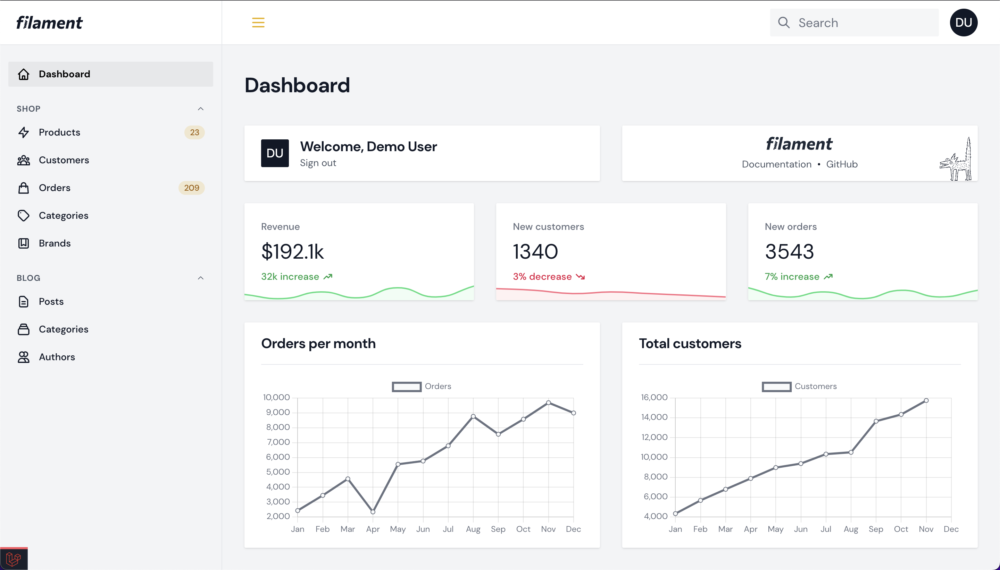
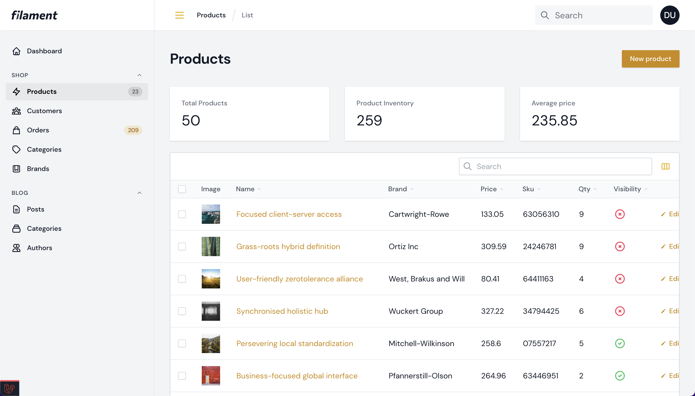
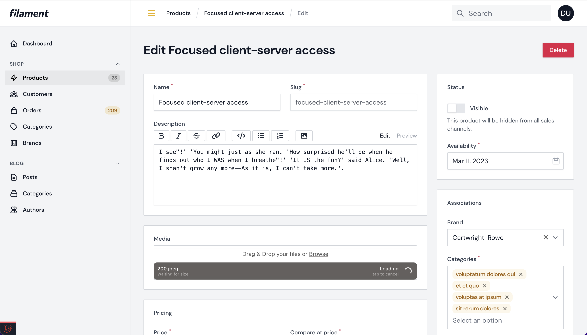

# A flat theme for Filament.

> **Warning**
>
> This repository is still experimental and not fleshed out yet. Dark mode support hasn't been checked and there are likely some missing styles for certain components, etc.

## Screenshots

**Dashboard**



**Table**



**Form**



## Installation

Right now, the best way to use this theme is by [copying the CSS file](./flat.css) into your `public/css` directory and registering the theme with Filament in a ServiceProvider.

```php
class AppServiceProvider extends ServiceProvider
{
    public function boot()
    {
        Filament::serving(function () {
            Filament::registerStyles([
                'flat' => public_path('css/flat.css'),
            ]);
        });
    }
}
```